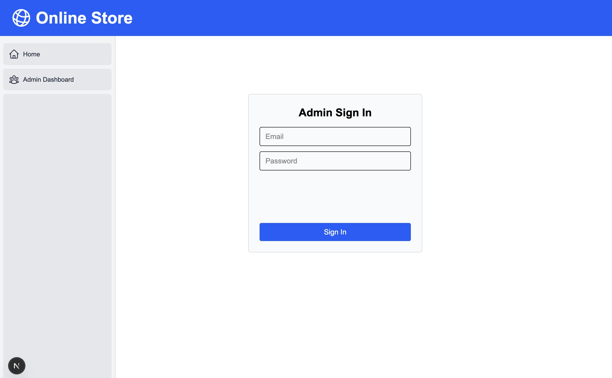
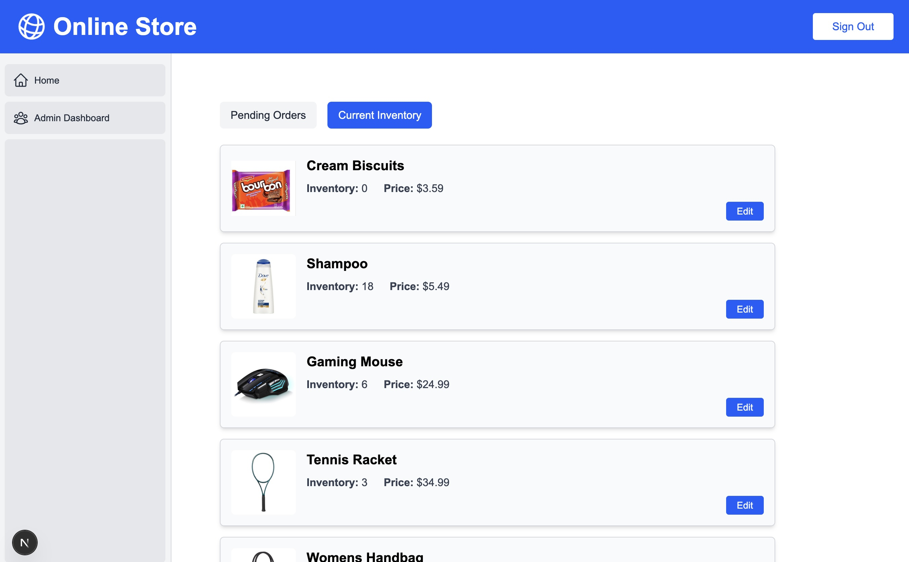

This is a [simple website](https://nextjs-store-smoky-six.vercel.app) for an online store built using Next.js, React, and Typescript. It is deployed on Vercel.

## Customer Pages

On the home page, the list of available products are shown to the customers. There is a search bar to search through the product list.

Note: All product information was generated randomly.

---
A customer can click on the products for more details on them. 

---

If they wish to order the product, they can simply submit their name and address. They can pay in cash upon delivery.

## Manager Pages

The store managers can access their dashboard using the Admin Dashboard button on the left. This prompts the user to sign in.

---

After signing in, they can view the orders the customers have placed. Once the orders are shipped, they can click Fill Order which will decrease the inventory for the product by 1 and remove that order from this list.

Note: All customer information was generated randomly.

---

The store managers can also view inventory details of all the products using the Current Inventory button.

---

They can make edits to each product's inventory and price.

---